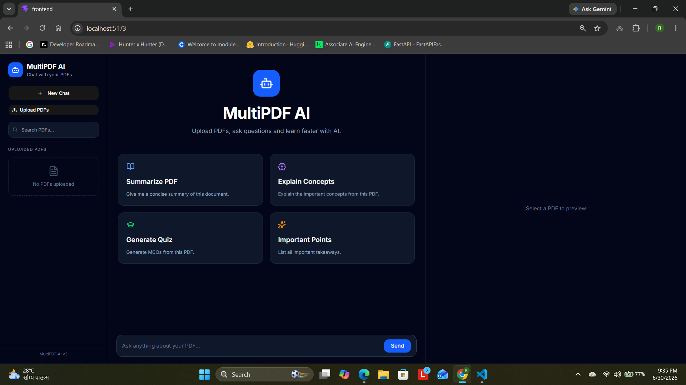
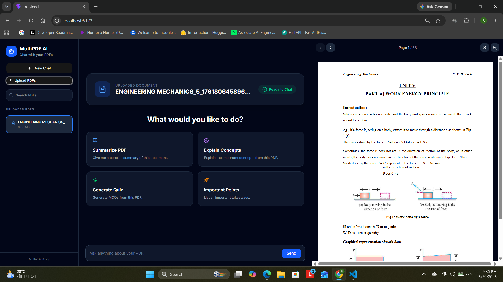
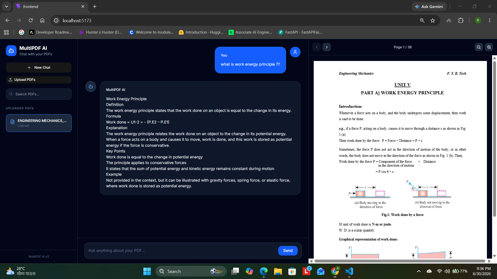

# 🚀 MultiPDF AI

An AI-powered PDF chatbot that lets you upload PDFs, ask questions, and receive context-aware answers using Retrieval-Augmented Generation (RAG).

---

## ✨ Features

- 📄 Upload and chat with PDF documents
- 🤖 AI-powered answers using Groq LLM
- 🔍 Retrieval-Augmented Generation (RAG)
- ⚡ Streaming responses
- 📑 Built-in PDF Viewer
- 🔎 Zoom and page navigation
- 📝 Markdown rendering
- 🎨 Modern responsive UI

---

## 🛠 Tech Stack

### Frontend

- React
- Vite
- Tailwind CSS
- React PDF
- Axios
- Lucide Icons

### Backend

- FastAPI
- LangChain
- FAISS
- Groq API
- Python

---

## 📸 Screenshots

### Home



---

### Upload PDF



---

### Chat + PDF Viewer



---

## ⚙️ Installation

### Backend

```bash
cd backend

pip install -r requirements.txt

uvicorn app:app --reload
```

### Frontend

```bash
cd frontend

npm install

npm run dev
```

---

## 📂 Project Structure

```
backend/
frontend/
uploads/
faiss_index/
assets/
```

---

## 🚀 Future Improvements

- Clickable citations
- Jump to source page
- Highlight referenced text
- Chat history
- Multi-document comparison
- Authentication
- Cloud deployment

---

## 👨‍💻 Author

**Ram Masane**

B.Tech Mechanical Engineering

AI & Data Engineering Enthusiast